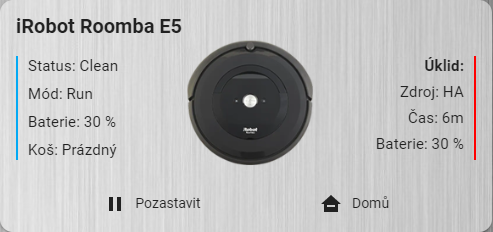

<h1 align="center">
    iRobot Roomba e5 Home Assistant Setup
</h1>

Home Assistant - iRobot Roomba e5 Configuration using local rest980 API

This repository provides configuration to get an iRobot Roomba e5 robot vacuum cleaner integrated with Home Assistant using the local rest980 API.

    

## Setup Instructions

### Step 1: Prerequesites

The following custom components are used in this deployment - these can be installed from HACS
- [lovelace-roomba-e5-card] - Custom Plugin Repository
- [rest-980-api-hass-addon] - Custom HA Addon

### Step 2: Get Robot Login Details

**NOTE:** Do not have iRobot App running on your phone when doing this !!!

README update coming soon ...

### Step 3: Configure HA Addon
README update coming soon ...

### Step 4: Import Home Assistant Configuration
README update coming soon ...

## Disclaimer

This project is not affiliated, associated, authorized, endorsed by, or in any way officially connected with the iRobot Corporation,
or any of its subsidiaries or its affiliates. The official iRobot website can be found at https://www.irobot.com

## Credits

- [Facu ZAK][facuzak] for creating dorita980 and rest980 !
- [Jeremy Willans][jeremywillans] for creating the lovelace card for iRobot Roomba i7+ from which my lovelace card is shamelessly derived from!

[![BMC]](https://www.buymeacoffee.com/pasleto)

[BMC]: https://www.buymeacoffee.com/assets/img/custom_images/white_img.png
[facuzak]: https://github.com/koalazak
[rest980]: https://github.com/koalazak/rest980
[dorita980]: https://github.com/koalazak/rest980
[jeremywillans]: https://github.com/jeremywillans
[ha-rest980-roomba]: https://github.com/jeremywillans/ha-rest980-roomba
[lovelace-roomba-e5-card]: https://github.com/pasleto/lovelace-roomba-e5-card
[rest-980-api-hass-addon]: https://github.com/pasleto/hass-addons/tree/master/rest980_api